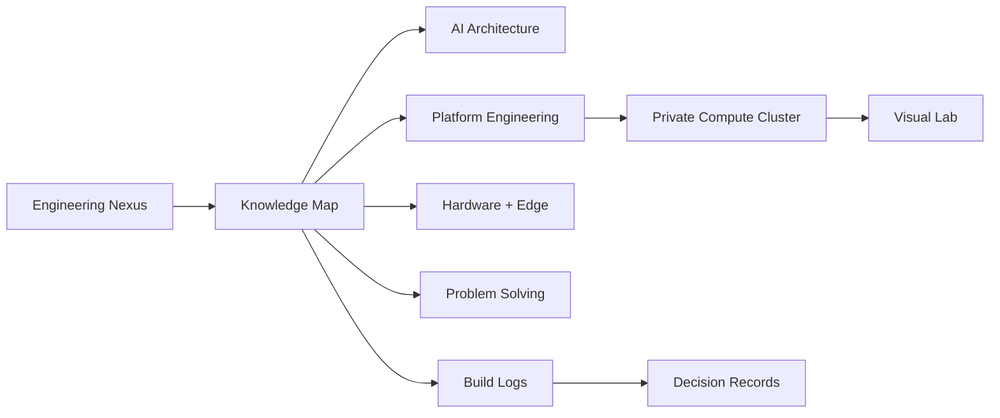

The wiki is organized around durable engineering domains rather than temporary folders.
Each page should be easy to search, easy to update, and connected to related systems.

## Navigation Model



## Primary Domains

| Domain | What Belongs Here |
| --- | --- |
| AI Architecture | Agents, RAG, model routing, evaluation, applied AI systems |
| System Architecture | Distributed systems, APIs, queues, databases, tradeoff analysis |
| Platform Engineering | OpenStack, Kubernetes, DevOps, SRE, internal platforms |
| Hardware + Edge | Drones, IoT, embedded systems, electronics, custom OS/ROM work |
| Problem Solving | LeetCode, algorithms, CAT Quant, VARC, DILR, math patterns |
| Build Logs | Experiments, implementation notes, debugging journals, retrospectives |

## Page Standard

Every substantial page should answer five questions:

1. What is the system or idea?
2. Why does it matter?
3. What are the constraints?
4. What are the design decisions?
5. What would be changed after learning from implementation?

## Metadata Standard

Use frontmatter consistently so the site can grow into a queryable knowledge base:

```yaml
title: Private Compute Cluster
description: OpenStack, Ceph, KVM, QEMU, and SDN architecture.
tags: [OpenStack, Ceph, SDN, KVM]
status: active
level: advanced
```

## Linking Rules

- Link every project page back to one primary track.
- Link every architecture diagram to the project or decision it explains.
- Link every build log to the system, bug, or experiment that produced it.
- Prefer stable slugs under `/engineeringnexus/` so pages stay durable on GitHub Pages.
