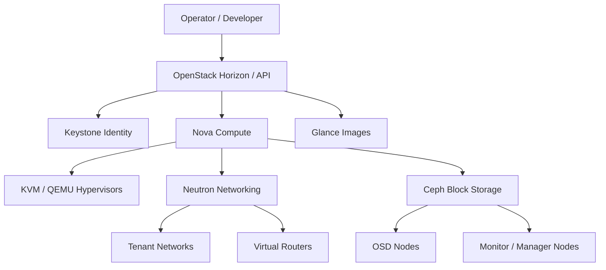

The Private Compute Cluster is the flagship infrastructure project in this wiki.
It combines cloud orchestration, distributed storage, virtualization, and software-defined
networking into a private platform for running virtualized workloads.

## System Intent

The goal is to design a private cloud that exposes cloud-like infrastructure primitives
without depending entirely on a public cloud provider. It should demonstrate strong
systems taste: clean network boundaries, resilient storage, understandable operations,
and enough automation that the platform can be rebuilt and explained.

## Architecture Layers

| Layer | Technology | Purpose |
| --- | --- | --- |
| Orchestration | OpenStack | VM lifecycle, identity, images, networking, APIs |
| Compute | KVM/QEMU | Hardware virtualization and guest execution |
| Storage | Ceph | Distributed block/object storage and resilience |
| Network | Neutron + SDN | Tenant networks, routing, isolation, overlays |
| Operations | Runbooks + observability | Deployment, debugging, and reliability |

## Reference Architecture

## Design Questions

| Question | Current Direction |
| --- | --- |
| How are tenants isolated? | Neutron networks, routers, and security groups. |
| How is VM storage made resilient? | Ceph-backed volumes and image storage. |
| How are failures diagnosed? | Runbooks, service health checks, and topology diagrams. |
| How does this become repeatable? | Documented deployment steps first, automation after patterns stabilize. |

## Current References

- [Original summary](/OpenStack/PrivateComputeCluster/)
- [Neutron Network Architecture](/OpenStack/PrivateComputeCluster/NeutronNetworkArchitecture/)

## Next Improvements

- Add polished architecture diagrams
- Add deployment runbooks
- Add failure-mode analysis
- Add capacity-planning notes
- Add networking deep dives
