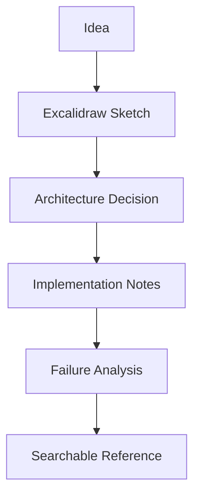

The visual lab is for making complex systems understandable.

## Supported Visualization Modes

| Mode | Best Use | Storage |
| --- | --- | --- |
| Mermaid | Fast flows, state machines, sequence diagrams, dependency maps | Markdown code blocks |
| Excalidraw | Sketch-first architecture thinking and rough topology | Export PNG/SVG into `src/assets` |
| Polished SVG / PNG | Portfolio-grade architecture references | `src/assets` with nearby explanation |
| Tables | Tradeoffs, comparisons, capacity planning, decision matrices | Markdown tables |
| Decision records | Constraints, alternatives, consequences, failure modes | Dedicated Markdown page |

## Mermaid Example



## Diagram Workflow

1. Sketch rough architecture in Excalidraw.
2. Convert stable flows into Mermaid or SVG.
3. Store exported assets in `src/assets`.
4. Explain design tradeoffs beside the diagram.

## Excalidraw Standard

Excalidraw sketches should keep the messy thinking visible while still being readable.
Use them for early topology, network segmentation, service boundaries, incident maps,
and interview-style architecture explanation.

When a sketch becomes stable, export it and add:

- A short caption explaining the system boundary.
- A list of assumptions and constraints.
- Links to related implementation notes.
- A follow-up Mermaid or polished diagram if the design needs precision.

## Architecture Decision Template

```markdown
## Context

What problem or constraint forced this decision?

## Options

What alternatives were considered?

## Decision

What was chosen and why?

## Consequences

What improves, what gets worse, and what needs monitoring?
```
